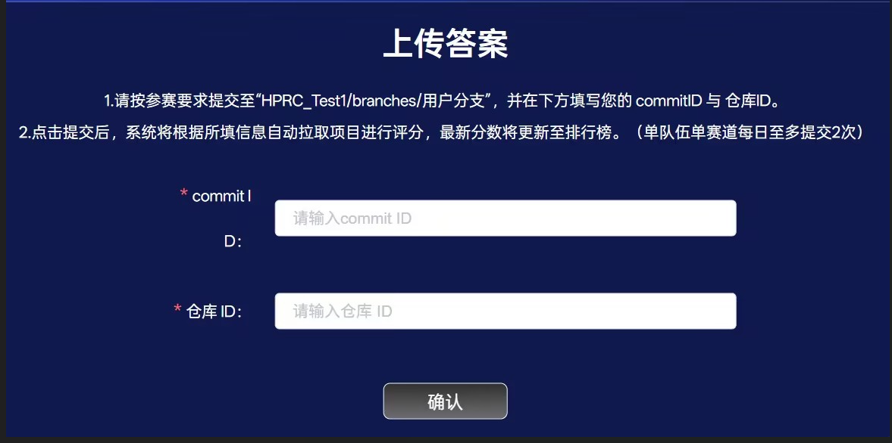
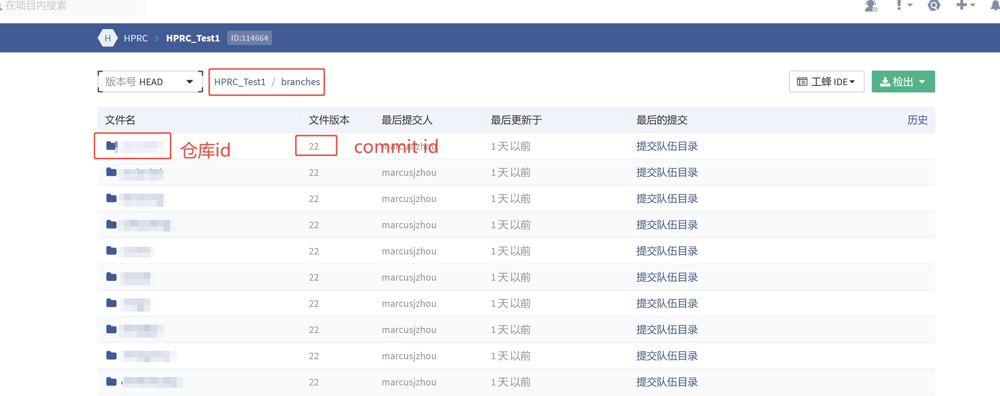

### 数据说明

#### 文件类型
我们提供两种文件，包含光照数据文件以及掩码文件 <br>
掩码文件标识了对应区域的光照数据是否有效，无效位置光照忽略即可
1. **光照数据文件** (`lightmapRawData_*`)
    - 包含RGB三通道的光照信息
    - 数据类型：`float32`
    - 每个像素3个float32值（R、G、B）
    - 数据按照行优先存储，RGB按顺序存储
    - 文件大小: `width × height × 3 × 4 bytes`
    - 包含1-24点，整点时刻的lightmap数据，以及两个开关灯相关的时刻（5.9, 18.1）

2. **掩码文件** (`lightmapCoverage_*`)
   - 标识有效/无效像素区域
   - 数据类型：`int8`
   - 每个像素1个int8值
   - 数据按照行优先存储
   - 文件大小: `width × height × 1 bytes`

#### 掩码值含义
掩码文件宽高与LightMap文件相同，掩码文件的每个像素的值标识了对应的LightMap像素是否有效
- **-1**: 无效数据像素
- **127**: 有效数据像素

#### 读取示例
请参照脚本**ReadData.py**

#### 文件说明
文件分为两种类型：
1. LightMap数据：例如lightmapRawData_Dilate_HQ_Lightmap...，表示LightMap的源文件，不包含方向性部分
2. LightMap的Mask数据：例如lightmapCoverage_Dilate_HQ_Lightmap...，表示LightMap的Mask文件

名字的含义：
以lightmapRawData_Dilate_HQ_Lightmap_0_81_100_0_L_Foliage_Probe_BuiltData_TOD_100_1024_512.bin_0为例：
1. HQ_Lightmap_0_81_100_0_L_Foliage_Probe_BuiltData表示LightMap的完整名字，和引擎中的LightMap名字一致
2. 数字编码0_81_100_0：
    - **0**： 第一个数字0表示Level中LightMap的唯一标识符，Level与该标识符共同确认一张LightMap
    - **81**：第二个数字81为引擎中LightMap的计数，不需要额外关注这个变量
    - **100**：第三个数字100表示这张贴图对应的时间，100表示当前时间为1:00，550表示当前时间为5:30，即将该数字作为整数除以100后对应浮点数时间
    - **0**： 第四个数字0是放重标识，不需要额外关注这个变量 
3. L_Foliage_Probe表示当前LightMap在引擎中所属的Level
4. TOD_100同样表示贴图对应的时间
5. 1024_512表示当前LightMap的分辨率，为1024x512分辨率

#### 数据集说明
数据集结构示意如下：<br>
📁Data_HPRC <br>
├── config.json <br>
├── lightmapCoverage_Dilate_HQ_Lightmap_0_79_100_0_L_Foliage_Probe_BuiltData_TOD_100_1024_512.bin_0 <br>
├── lightmapRawData_Dilate_HQ_Lightmap_0_79_100_0_L_Foliage_Probe_BuiltData_TOD_100_1024_512.bin_0 <br>
├── lightmapCoverage_Dilate_HQ_Lightmap_1_81_200_0_L_Foliage_Probe_BuiltData_TOD_200_1024_512.bin_0 <br>
├── lightmapRawData_Dilate_HQ_Lightmap_1_81_200_0_L_Foliage_Probe_BuiltData_TOD_200_1024_512.bin_0 <br>
├── lightmapCoverage_Dilate_HQ_Lightmap_2_77_300_0_L_Foliage_Probe_BuiltData_TOD_300_1024_512.bin_0 <br>
├── lightmapRawData_Dilate_HQ_Lightmap_2_77_300_0_L_Foliage_Probe_BuiltData_TOD_300_1024_512.bin_0 <br>

config文件中含有该数据集的相关信息
- **lightmap_count** 表示该数据集中共有多少张lightmap
- **lightmap_list** 对应每张lightmap信息，其中包括
    - **id**：lightmap对应的id
    - **level**：lightmap所属的level，level和id一起，唯一确定一张lightmap
    - **lightmaps**：所有时刻lightmap文件的路径，根据时间进行索引
    - **masks**：所有时刻mask文件的路径
    - **resolution**：lightmap对应的分辨率

在大赛提供的数据集中，我们每间隔一个小时烘焙一套LightMap

我们还提供开光灯相关的LightMap数据

开光灯指场景中部分静态Local光源将从6.0至18.0时刻处于关闭状态，其它时间处于开启状态

我们额外提供5.9以及18.1时刻的LightMap，这两个时刻都处于开灯状态，6.0以及18.0时刻则处于关灯状态

### 接口说明

注意，你需要设计支持 **Random-Access** 的算法，我们可能会随机生成采样坐标进行测试。

> **Random-Access**：指的是可以直接跳转到任意位置访问数据，访问时间基本与位置无关，不需要先经过访问其他的数据

你需要自行实现 **Interface.py** 中的各个接口，包括类 `BasicInterface`中的各个接口，以及一个`get`接口

#### BasicInterface 接口实现

`BasicInterface` 中必须包含以下接口：

##### 1. `reconstruct` 
- **功能**：根据输入的时间，执行完整的解压计算过程
- **说明**：在此方法中实现你的完整解压算法，我们将统计该接口的运行耗时
- **输入参数说明**: `current_time`为当前时间，范围 `[0, 24]`（浮点数）

##### 2. `get_result`   
- **功能**：返回解压后的完整 lightmap 数据
- **返回格式**：`torch.Tensor`，形状为 `[1, 3, height, width]`
- **说明**：返回数据必须位于 `get` 接口传入的目标 `device` 上

##### 3. `random_test` 
- **功能**：实现 Random-Access 随机访问测试
- **目的**：验证算法支持任意位置的快速访问

**参数格式**：
- **输入**：`coord` - `torch.Tensor`，形状 `[1, 3]`
  - 包含一个坐标点的三个分量：`[y, x, time]`
  - `y`, `x`：像素整数坐标（非归一化），分别对应纵坐标和横坐标
    - `[0, 0]` = 左上角像素
    - `[0, 50]` = 第1行第51个像素  
  - `time`：时间值，范围 `[0, 24]`（浮点数）
- **输出**：`torch.Tensor`，形状 `[1, 3]`，对应坐标点的 RGB 值

#### get 接口实现

你同样需要实现 **Interface.py** 的 `get` 接口，以返回一个对应的 `BasicInterface` 对象。

- **功能**：根据输入参数，返回一个可以解压出对应完整的 lightmap 的 `BasicInterface` 对象

**输入参数说明**：
- `lightmap_config`：待解压 lightmap 的配置信息
- `device`：目标设备，`get_result` 和 `random_test` 的返回数据需要位于该设备上

#### 注意事项

- 我们只对`reconstruct`以及`get_result`接口进行计时操作，你可以在`BasicInterface`对象初始化时读取参数，这些操作将不计入耗时
- 你可以使用 **Test.py** 脚本来简单测试你的接口是否可用并符合你的预期
- 在 **environment.yaml** 中，我们提供了一个 python 虚拟环境，我们将在该环境下运行测试你的接口，请确保你的接口在该环境下正常运行
- 如果你需要该虚拟环境之外的第三方库，请在大赛中及时与我们沟通，并且提供能够安装的 **requirement** 文件


### 环境安装
基础环境需要安装Visual Studio 2022。

建议使用conda来管理你的Python环境，安装该环境建议使用**Python=3.11, CUDA=12.9**。
```
pip install -r requirements.txt
```
如果由于设备原因，该**CUDA**版本可能不处于你设备的兼容范围内，你可以修改requirement.txt中的内容以兼容你的设备。在安装pytorch和下载模型中如果遇到下载失败问题或者速度过慢，可以手动下载并放在本地环境中。

如果你需要使用**tiny-cuda-nn**，你需要额外进行安装
```
pip install git+https://github.com/NVlabs/tiny-cuda-nn/#subdirectory=bindings/torch
```

### 样例说明
我们提供了一个简单的数据集以及训练脚本，你可以参考训练以及推理过程来理解我们的任务 

**ExampleModel.py**定义了一个简单的MLP模型，输入是lightmap的坐标，当前时间以及一个三维特征，输出lightmap对应位置的RGB值 

**ExampleTrain.py**展示了一个简单的训练流程，从读取数据到优化再到保存结果，训练策略不具有参考价值，请制定你自己的训练策略 

**Interface.py**中，我们提供了一个实现样例，你可以参考该样例理解大致流程 

你可以直接运行我们提供的**Test.py**来获取该简易模型在SimpleData数据集上的重建结果的各项指标 

### 评估指标

#### 指标得分计算
我们将对各项指标指定有效范围，在有效范围内计算得分：
- 如果你的指标高于指定的最大值，按满分计算，低于指定最小值则按0分计算
- 具体范围可以查看 `config.yaml` 文件（组委会将根据提交结果微调最大值与最小值）
- [大赛评价标准](https://doc.weixin.qq.com/doc/w3_AH8A_AaSACQCN8gvkuU9ST7aX902j?scode=AJEAIQdfAAoBhkKMk7AH8A_AaSACQ) 

**计算公式**：

**best_value** 和 **worst_value** 及有效范围的边界，**value**为具体指标，且截断在 [worst_value, best_value] 内

- 对于**PSNR**以及**SSIM**：**score = 100 * (value - worst_value) / (best_value - worst_value)**
- 对于**LPIPS**，**推理时间**以及**压缩率**：**score = 100 * (worst_value - value) / (worst_value - best_value)**

#### 图像重建质量评估
我们会进行图像重建质量的计算，包括：
- **PSNR** 
- **SSIM** 
- **LPIPS** 

**评估方式**：将lightmap划分为 256 × 256 的小块，每块计算各项指标，最终取平均值

#### 压缩率计算

##### 参数存储要求
- 请将解压过程中使用到的所有参数存放在 **Parameters** 文件夹中
- 参数文件需要是原始大小的二进制文件，不能对文件进行任何额外压缩，可以参考 `ExampleTrain.py` 中我们保存参数的方式
- 读取参数时只允许从该文件夹中进行读取

##### 模型大小统计
在计算压缩率时，需要考虑你的模型的所有参数以及隐空间特征

例如样例模型： 
``` python
class ExampleModel(nn.Module):
    def __init__(self, input_dim = 6, output_dim = 3, hidden_dim = 256):
        super(ExampleModel, self).__init__()
        self.featuremap = torch.nn.Parameter(torch.empty((1, 3, 32, 32), dtype=torch.float32, requires_grad=True))
        self.model = nn.Sequential(
            nn.Linear(input_dim, hidden_dim), 
            nn.ReLU(),
            nn.Linear(hidden_dim, hidden_dim),
            nn.ReLU(),
            nn.Linear(hidden_dim, hidden_dim),
            nn.ReLU(),
            nn.Linear(hidden_dim, hidden_dim),
            nn.ReLU(),
            nn.Linear(hidden_dim, hidden_dim),
            nn.ReLU(),
            nn.Linear(hidden_dim, hidden_dim),
            nn.ReLU(),
            nn.Linear(hidden_dim, output_dim),
        )
        with torch.no_grad():
            nn.init.normal_(self.featuremap, mean=0.5, std=0.0)
```
需要统计`featuremap`的大小以及`mlp`的大小总计334595个`float32`

当然你可以对你的模型进行量化，我们将以量化后的大小作为计算标准 

那么如果你使用该模型压缩一张256 * 256的lightmap 

对于原始数据而言，该模型的压缩率大约是：1.28MB / 18MB = 0.071 

### 拉取代码说明
大家在拉取工程和数据代码的时候，建议按照如下几个目录来依次拉取：
1. https://svn.tencent.com/HPRC/HPRC_Test1/trunk
2. https://svn.tencent.com/HPRC/HPRC_Test1/branches/test
3. https://svn.tencent.com/HPRC/HPRC_Test1/branches/YourTeam

### python依赖包服务端安装

1. “HPRC_Test1\trunk\requirements.txt” 中包含官方支持的 Python 依赖包，已在测评服务器完成统一部署，参赛队伍无需额外配置；
2. 若参赛队伍需使用官方支持包之外的新增 Python 依赖包，需上传至指定路径：“HPRC_Test1\branches\YourTeam\requirements.txt”。该文件默认为空，仅需填写新增依赖包（无需重复官方已提供的包）；
3. 因 Python 环境兼容性较难统一，为避免服务端评测失败，建议参赛队伍优先使用官方推荐的依赖包。

### 提交&测评说明
大家在官网提交时，需要提交commit id和仓库id，如下图所示


其中仓库id是每个队伍唯一的，是队长的用户名，在“HRPC_Test1/branches/仓库id”目录，其中大家可以看到一个“test”名称的仓库，是我们 提供的测试用例。commit id每次提交都会递增，是一个整数，默认是”22“，具体如下图所示：


#### 本地测评脚本
```
python Fetch.py --branch 参赛队伍分支仓库ID --revision Commit ID --user svn的用户名 --passwd svn的密码
```
大家利用直接运行trunk目录下面的Fetch脚本，就能测评自己分支的分数，由于推理耗时依赖机器，耗时的计算会和服务器上的计算存在偏差，服务端所有机器的硬件都是4090D；

#### 注意事项
在服务器测评的时候，会直接运行“HRPC_Test1/branches/仓库id/Test.py”文件，所以确保提交时，这个文件在仓库分支下是可以正常运行的。